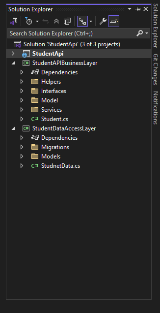
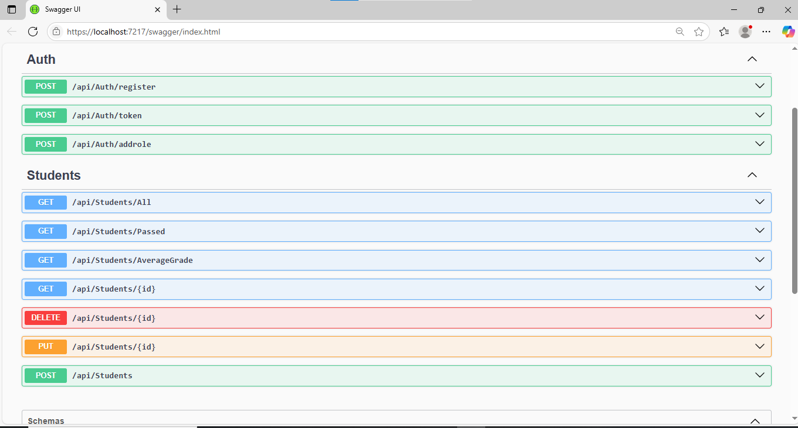

# StudentManagement.ThreeTier.ADO_EF_Identity

# نظام إدارة الطلاب – ثلاث طبقات (ADO.NET + EF Identity)

---

## نظرة عامة

مشروع باك-إند احترافي لإدارة الطلاب مبني باستخدام معمارية ثلاث طبقات **(3-Tier Architecture)**، مع فصل كامل بين الوصول للبيانات والمنطق والأمان:

- **طبقة الوصول للبيانات (DAL):** باستخدام **ADO.NET** وكتابة استعلامات وإجراءات مخزنة (Stored Procedures) في SQL.
- **طبقة الأعمال (BLL):** تحتوي جميع القواعد والمنطق الخاص بالتعامل مع الطلاب (تستخدم DTO لنقل البيانات بأمان).
- **طبقة الهوية والمصادقة:** باستخدام **ASP.NET Identity** (EF) لتسجيل الدخول، التسجيل، وإدارة الأدوار بشكل آمن وحديث.

> **بدون واجهات مستخدم (لا يوجد Front-End)** – المشروع خاص بالـ API فقط ويعرض عبر Swagger UI.

---

## الميزات

- فصل كامل للطبقات (DAL, BLL, API)
- CRUD كامل للطلاب (إضافة، تحديث، حذف، استعلام حسب ID أو الكل)
- حساب الطلاب الناجحين ومتوسط الدرجات
- مصادقة وتسجيل دخول وإدارة أدوار (Identity)
- استخدام الإجراءات المخزنة في قواعد البيانات (Stored Procedures)
- توثيق Swagger لجميع نقاط النهاية (Endpoints)
- الكود نظيف وموثّق ويسهل التوسع عليه مستقبلاً

---

## التقنيات المستخدمة

- C# .NET (8)
- ADO.NET (للتعامل مع الطلاب)
- Entity Framework Identity (للمصادقة وتسجيل المستخدمين)
- SQL Server (مع إجراءات مخزنة)
- Swagger UI (لتجربة واختبار الـ API)

##
ADO.NET:
يُستخدم هنا لإدارة بيانات الطلاب مباشرة عبر الاستعلامات والإجراءات المخزنة، ويمنحك سرعة وتحكم كامل في العمليات على قواعد البيانات، وهو مناسب عند الحاجة لأداء عالٍ وتحكم كبير في طريقة التعامل مع البيانات.

Entity Framework Identity:
يُستخدم لإدارة المستخدمين وتسجيل الدخول والأدوار بطريقة حديثة وآمنة جداً دون الحاجة لإعادة اختراع العجلة في كل مرة، ويتيح توسيع النظام مستقبلاً بسهولة.

الجمع بين الاثنين يعطيك:

تحكم كامل وأداء عالي لإدارة بيانات الطلاب.

أمان وإدارة حديثة وسريعة للمستخدمين والأدوار.

هيكلية المشروع

StudentApi

├── StudentApi               # الطبقة العليا (API)

├── StudentAPIBusinessLayer  # طبقة الأعمال (الخدمات، النماذج، الواجهات)

├── StudentDataAccessLayer   # طبقة البيانات (ADO.NET، EF Identity، النماذج، الهجرات)

---

-- Dev : Eng Zain Ali
